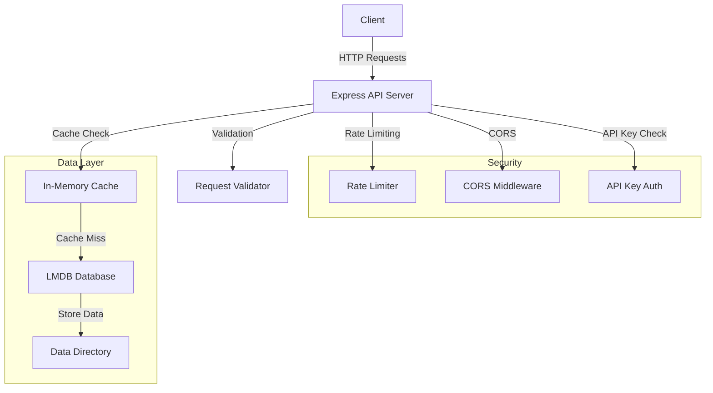
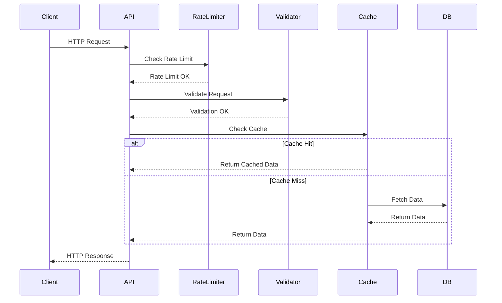

# Project Documentation

## Overview
This is a Node.js-based API server that provides a secure and efficient way to handle data storage and retrieval using LMDB (Lightning Memory-Mapped Database). The application implements various security measures, caching mechanisms, and follows best practices for API development. It streams all entries from an LMDB store using [lmdb-js](https://github.com/DoctorEvidence/lmdb-js), with proper handling of network back-pressure and client disconnects.

## Table of Contents
1. [Prerequisites](#prerequisites)
2. [Installation](#installation)
3. [Configuration](#configuration)
4. [Architecture](#architecture)
5. [API Endpoints](#api-endpoints)
6. [Security Features](#security-features)
7. [Performance Optimizations](#performance-optimizations)
8. [Testing](#testing)
9. [Development](#development)
10. [Cache Management](#cache-management)
11. [Performance Monitoring](#performance-monitoring)

## Prerequisites
- Node.js (v16 or higher)
- npm (Node Package Manager)

## Installation

1. Clone the repository:
```bash
git clone https://github.com/lucip5750/testh.git
cd testh
```

2. Install dependencies:
```bash
npm install
```

3. Seed the database with mock data:
```bash
node seed.js
```

4. Set up environment variables (optional):
Create a `.env` file in the root directory with the following variables:
```
PORT=3000
API_KEY=your-api-key
ALLOWED_ORIGINS=http://localhost:3000
NODE_ENV=development
```

## Configuration

### Environment Variables
- `PORT`: Server port (default: 3000)
- `API_KEY`: API key for authentication
- `ALLOWED_ORIGINS`: Comma-separated list of allowed CORS origins (default: ['http://localhost:3000'])
- `NODE_ENV`: Environment mode (development/production)

### Rate Limiting
- Window: 15 minutes
- Max requests: 100 per IP
- Headers: X-RateLimit-* (legacy headers enabled)
- Error Response: 429 status code with custom message

### Caching
- TTL: 5 minutes
- In-memory cache implementation
- Automatic cache cleanup every minute
- Cache statistics endpoint available
- Manual cache clearing capability

## Architecture

### System Overview



### Request Flow



### Components Description

1. **Client**
   - External applications making HTTP requests to the API
   - Must include valid API key in headers

2. **Express API Server**
   - Main application server
   - Handles HTTP requests and responses
   - Implements middleware pipeline

3. **Security Layer**
   - Rate Limiter: Prevents abuse (100 requests per 15 minutes)
   - CORS: Controls cross-origin requests
   - API Key Authentication: Validates API keys

4. **Data Layer**
   - In-Memory Cache: 5-minute TTL for frequently accessed data
   - LMDB Database: Persistent storage
   - Data Directory: Physical storage location

5. **Validation**
   - Request validation using express-validator
   - Input sanitization and type checking
   - Custom validation rules for endpoints

## API Endpoints

### GET /entries
Retrieves entries from the database with pagination support.

**Query Parameters:**
- `limit` (optional): Number of entries to return (1-100, default: 100)
- `offset` (optional): Number of entries to skip (default: 0)

**Headers Required:**
- `x-api-key`: API key for authentication

**Response:**
```json
[
  {
    "key": "entry-key",
    "value": "entry-value"
  }
]
```

### GET /cache-stats
Returns cache statistics.

**Headers Required:**
- `x-api-key`: API key for authentication

**Response:**
```json
{
  "size": 1,
  "keys": ["all_entries"],
  "ttl": 300000
}
```

### GET /clear-cache
Manually clears the cache.

**Headers Required:**
- `x-api-key`: API key for authentication

**Response:**
```json
{
  "message": "Cache cleared successfully"
}
```

## Security Features

### API Key Authentication
- Required for cache endpoints
- Configured via environment variable
- Validates through `x-api-key` header

### CORS Protection
- Configurable allowed origins
- Secure headers configuration
- Pre-flight request handling
- 24-hour preflight cache
- Supports credentials

### Rate Limiting
- IP-based request limiting
- Configurable time window
- Custom error messages
- Legacy header support

### Input Validation
- Request parameter validation
- Input sanitization
- Type checking
- SQL injection prevention
- Special character escaping

## Performance Optimizations

### Caching Strategy
- In-memory cache with TTL
- Automatic cache invalidation
- Cache cleanup on interval
- Cache statistics monitoring
- Manual cache control

### Database Optimization
- LMDB for high-performance storage
- Compression enabled
- Efficient data retrieval
- Streaming support
- Back-pressure handling

### Response Handling
- JSON streaming support
- Back-pressure handling
- Client disconnect detection
- Request timing monitoring
- Performance logging

## Testing

Run the test suite:
```bash
npm test
```

The project uses Jest for testing with the following features:
- Automatic handle detection
- Force exit on completion
- Supertest for HTTP assertions
- Comprehensive endpoint testing
- Cache functionality verification
- Error handling scenarios
- Client disconnection handling
- Cache statistics and clearing

## Development

### Project Structure
```
.
├── server.js          # Main application file
├── seed.js           # Database seeding script
├── data/             # LMDB data directory
├── test-data/        # Test data directory
├── __tests__/        # Test files
│   └── server.test.js # Integration tests
└── package.json      # Project configuration
```

### Available Scripts
- `npm start`: Start the server
- `npm test`: Run tests
- `node seed.js`: Seed the database

### Best Practices
1. Always validate input data
2. Use environment variables for configuration
3. Follow the established error handling patterns
4. Maintain test coverage
5. Document API changes
6. Handle client disconnections
7. Implement proper error responses
8. Monitor performance metrics

## Error Handling

The application implements comprehensive error handling:
- Input validation errors (400)
- Authentication errors (401)
- Rate limit errors (429)
- Server errors (500)

Each error response includes:
- Error message
- Status code
- Additional context when applicable

## Performance Monitoring

The server logs timing information for:
- Cache hits/misses
- Database operations
- Request processing time
- Error conditions

Example log output:
```
Cache hit: returning cached entries (0.15ms)
Request completed in 5.23ms
```
or
```
Cache miss: fetching from database
Database fetch completed (25.45ms)
Request completed in 30.12ms
```

## Contributing

1. Fork the repository
2. Create a feature branch
3. Commit your changes
4. Push to the branch
5. Create a Pull Request

## License
ISC License 