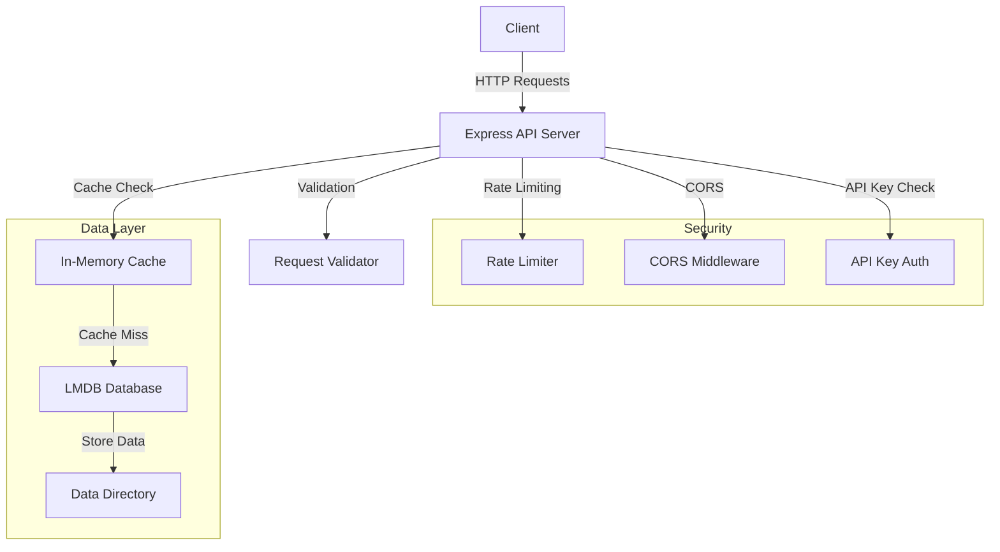
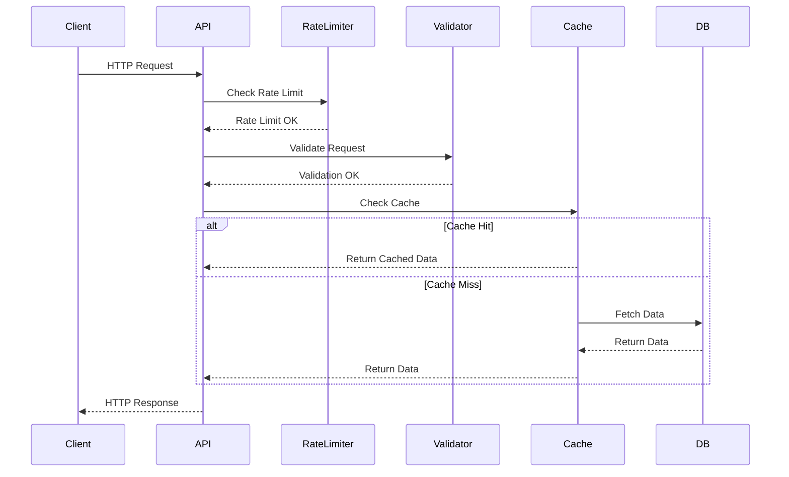

# Project Architecture

This document provides a visual representation of the project's architecture using Mermaid diagrams.

## System Overview

## Request Flow

## Components Description

1. **Client**
   - External applications making HTTP requests to the API
   - Must include valid API key in headers

2. **Express API Server**
   - Main application server
   - Handles HTTP requests and responses
   - Implements middleware pipeline

3. **Security Layer**
   - Rate Limiter: Prevents abuse (100 requests per 15 minutes)
   - CORS: Controls cross-origin requests
   - API Key Authentication: Validates API keys

4. **Data Layer**
   - In-Memory Cache: 5-minute TTL for frequently accessed data
   - LMDB Database: Persistent storage
   - Data Directory: Physical storage location

5. **Validation**
   - Request validation using express-validator
   - Input sanitization and type checking
   - Custom validation rules for endpoints 